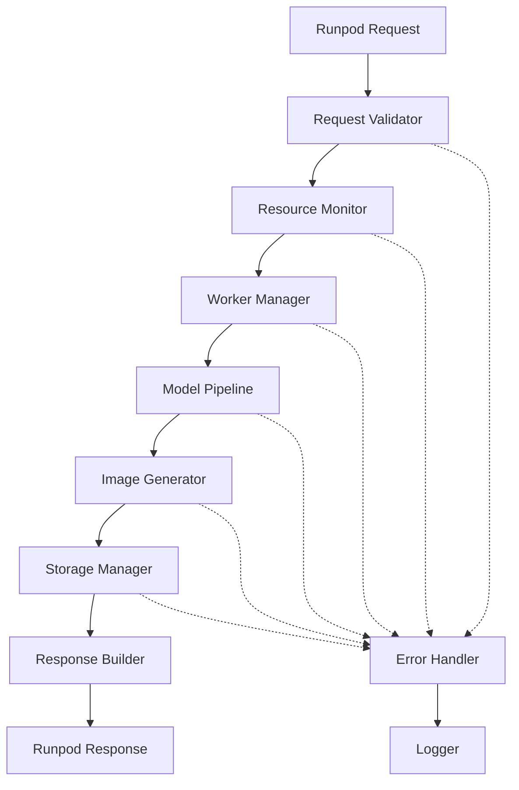

# Design Document

## Overview

The AI headshot generation service requires a robust architecture that can handle the resource-intensive FLUX model while providing reliable error handling and recovery mechanisms. The current implementation suffers from worker crashes due to inadequate resource management, insufficient error handling, and lack of proper initialization safeguards.

The redesigned system will implement a layered architecture with proper separation of concerns, comprehensive error handling, resource monitoring, and graceful degradation capabilities.

## Architecture

### High-Level Architecture



### Component Layers

1. **Request Layer**: Input validation and sanitization
2. **Resource Layer**: Memory and GPU monitoring
3. **Processing Layer**: Model initialization and image generation
4. **Storage Layer**: Supabase integration and file management
5. **Error Layer**: Comprehensive error handling and logging

## Components and Interfaces

### 1. Request Validator

**Purpose**: Validate and sanitize incoming requests before processing

**Interface**:
```python
class RequestValidator:
    def validate_request(self, job_input: dict) -> ValidationResult
    def sanitize_prompt(self, prompt: str) -> str
    def validate_user_id(self, user_id: str) -> bool
```

**Key Features**:
- Input schema validation
- Prompt sanitization for safety
- User ID format validation
- Request size limits

### 2. Resource Monitor

**Purpose**: Monitor system resources and prevent resource exhaustion

**Interface**:
```python
class ResourceMonitor:
    def check_gpu_memory(self) -> MemoryStatus
    def check_system_memory(self) -> MemoryStatus
    def can_process_request(self) -> bool
    def cleanup_resources(self) -> None
```

**Key Features**:
- GPU memory monitoring
- System memory tracking
- Resource availability checks
- Automatic cleanup triggers

### 3. Worker Manager

**Purpose**: Manage worker lifecycle and initialization state

**Interface**:
```python
class WorkerManager:
    def initialize_worker(self) -> InitializationResult
    def is_worker_ready(self) -> bool
    def reinitialize_if_needed(self) -> bool
    def shutdown_gracefully(self) -> None
```

**Key Features**:
- Lazy initialization
- Health checks
- Automatic recovery
- Graceful shutdown

### 4. Model Pipeline Manager

**Purpose**: Manage FLUX model lifecycle and generation requests

**Interface**:
```python
class ModelPipelineManager:
    def load_model(self) -> LoadResult
    def generate_image(self, prompt: str, **kwargs) -> GenerationResult
    def cleanup_after_generation(self) -> None
    def get_model_status(self) -> ModelStatus
```

**Key Features**:
- Model loading with retry logic
- Memory-efficient generation
- Post-generation cleanup
- Model health monitoring

### 5. Storage Manager

**Purpose**: Handle Supabase storage operations with retry logic

**Interface**:
```python
class StorageManager:
    def initialize_client(self) -> ClientResult
    def upload_image(self, image_data: bytes, file_path: str) -> UploadResult
    def generate_signed_url(self, file_path: str) -> URLResult
    def test_connection(self) -> ConnectionResult
```

**Key Features**:
- Connection pooling
- Retry mechanisms
- Error recovery
- URL generation

### 6. Error Handler

**Purpose**: Centralized error handling and logging

**Interface**:
```python
class ErrorHandler:
    def handle_initialization_error(self, error: Exception) -> ErrorResponse
    def handle_generation_error(self, error: Exception) -> ErrorResponse
    def handle_storage_error(self, error: Exception) -> ErrorResponse
    def log_system_state(self) -> None
```

**Key Features**:
- Structured error responses
- Detailed logging
- System state capture
- Error categorization

## Data Models

### Request Models

```python
@dataclass
class GenerationRequest:
    prompt: str
    user_id: str
    num_inference_steps: int = 25
    guidance_scale: float = 7.5

@dataclass
class ValidationResult:
    is_valid: bool
    errors: List[str]
    sanitized_request: Optional[GenerationRequest]
```

### Response Models

```python
@dataclass
class GenerationResponse:
    status: str
    image_url: Optional[str] = None
    error: Optional[str] = None
    processing_time: Optional[float] = None

@dataclass
class ErrorResponse:
    error_type: str
    message: str
    details: Dict[str, Any]
    timestamp: str
```

### System Status Models

```python
@dataclass
class MemoryStatus:
    total_mb: float
    used_mb: float
    available_mb: float
    usage_percent: float

@dataclass
class ModelStatus:
    is_loaded: bool
    model_name: str
    device: str
    memory_usage_mb: float
```

## Error Handling

### Error Categories

1. **Initialization Errors**
   - Missing environment variables
   - CUDA unavailability
   - Model loading failures
   - Storage connection issues

2. **Runtime Errors**
   - Out of memory conditions
   - Model generation failures
   - Storage upload failures
   - Network connectivity issues

3. **Validation Errors**
   - Invalid input format
   - Missing required fields
   - Unsafe content detection

### Error Recovery Strategies

1. **Graceful Degradation**
   - Return informative error messages
   - Maintain worker availability
   - Log detailed error context

2. **Automatic Recovery**
   - Retry failed operations with backoff
   - Reinitialize failed components
   - Clear GPU memory on errors

3. **Circuit Breaker Pattern**
   - Temporarily disable failing components
   - Prevent cascade failures
   - Automatic recovery attempts

## Testing Strategy

### Unit Testing

1. **Component Testing**
   - Request validation logic
   - Resource monitoring functions
   - Error handling mechanisms
   - Storage operations

2. **Mock Testing**
   - Model pipeline simulation
   - Storage client mocking
   - Error condition simulation

### Integration Testing

1. **End-to-End Testing**
   - Full request processing flow
   - Error scenario handling
   - Resource cleanup verification

2. **Load Testing**
   - Concurrent request handling
   - Memory leak detection
   - Performance under stress

### Error Scenario Testing

1. **Failure Simulation**
   - OOM conditions
   - Network failures
   - Model loading errors
   - Storage unavailability

2. **Recovery Testing**
   - Automatic recovery mechanisms
   - Graceful degradation
   - System state consistency

## Implementation Considerations

### Memory Management

1. **GPU Memory**
   - Explicit memory cleanup after each generation
   - Memory monitoring and alerts
   - Automatic garbage collection triggers

2. **System Memory**
   - Buffer size limits
   - Image processing optimization
   - Memory leak prevention

### Performance Optimization

1. **Model Efficiency**
   - Model quantization options
   - Batch processing capabilities
   - Inference optimization

2. **Storage Efficiency**
   - Async upload operations
   - Connection pooling
   - Retry with exponential backoff

### Monitoring and Observability

1. **Metrics Collection**
   - Request processing times
   - Error rates by category
   - Resource utilization trends

2. **Logging Strategy**
   - Structured logging format
   - Log level configuration
   - Error context preservation